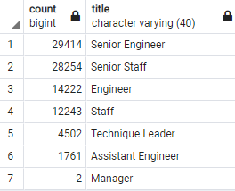

# Pewlett-Hackard-Analysis

## Overview of the analysis: 
The purpose of the Pewlett-Hackard analysis is to go several csv files that contain information on a companies employees such as employee information, departments, titles, etc. Using pgAdmin 4 and SQL, the data was put into tables with the specific primary keys as connections between each table. The data was then used to create new csv files with data was filtered and cleaned for specific management requests. The request was to find potential retirement candidates and their titles and generate csv files that contain the list of retirement eligible employees, the amount of potential retirees per unique title, and potential candidates for mentorship. This was completed by using SQL syntax on pgAdmin.

## Results:

- The total amount of employees that may be retiring is 90,398 using the sum of the retiring_titles.csv file that was generated as one of the queries. The majority of potential retirees have Senior roles such as Senior Engineer (29,414) and Senior Staff (28,254). This makes up 64% of the retiring group of employees. 
- Less than half of each Senior Role is retiring as well. This means that there is room for current staff to be promoted to senior positions and a large requirement for hiring new senior roles if many are not filled.
- Using the mentorship data, we can see that only 1,550 candidates are eligible to participate in the mentorshiop program. This pool of candidates does not fulfill the vast requirement of positions left behind by the future retirees.
- Finally, its fair to say that Pewllet-Hackard is in a very tight position and may potentially be in some trouble if a mass group of their employees decide to retire at the same time or earlier. It would be wise to start reorganizing the design of the work being done and seeing if there is a need for so many employees. A reorganization could prove that less employees could bring the same results.

## Summary: 
### How many roles will need to be filled as the "silver tsunami" begins to make an impact?
The total amount of employees that are eligble for retiring is 90,398. The majority of potential retirees have Senior roles such as Senior Engineer (29,414) and Senior Staff (28,254). This makes up 64% of the retiring group of employees. Their are only 2 Managers that will be retiring during this "silver tsunami".

### Are there enough qualified, retirement-ready employees in the departments to mentor the next generation of Pewlett Hackard employees?
There are 1,550 candidates that are eligible to participate in the mentorshiop program. This means if Pewlett-Hackard was to hire the same amount of employees as the future retirees, each candidate (if they all choose to participate in the mentorship program, would have to train 58 next generation employees. Since many may not be suitable trainers or willing to participate in the program, the will be a significant need for this organization to hire many new employees prior to the "silver tsunami" to ensure operations continue without any delay.

